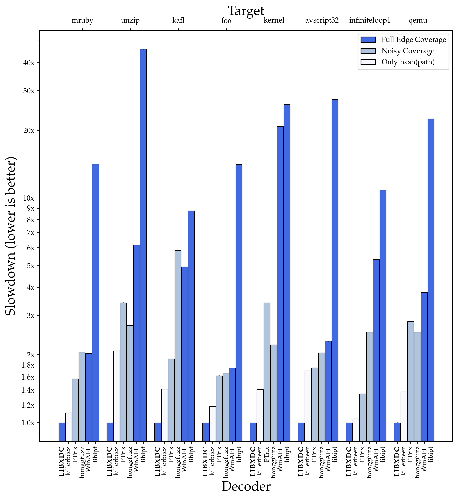
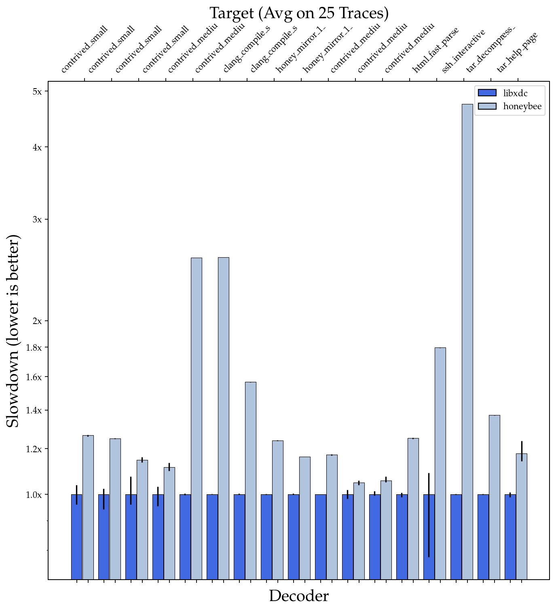

# Test Data for libxdc 

<p>

</p>

This repo contains the test data and experiments for our evaluation of [libxdc](https://github.com/nyx-fuzz/libxdc).

## Performance Evaluation

Extraordinary claims require extraordinary evidence. As such, we of course perform a set of entirely unfair and unscientific experiments to substantiate our performance claims. To check the decoding/disassembly performance of various available options for dealing with Intel PT data we setup an experiment in which we picked about 2 GB of traces from fuzzing various targets. We extracted various alternative approaches from other fuzzers such as WinAFL, Honggfuzz, PTrix and Killerbeez to create a controlled evaluation setup. Most of these tools only consider a subset of the data for performance reasons. It should be noted that some of these tools claim performance improvements over full decoders such as our approach used in kAFL. Notably, PTrix evaluated against various alternatives, but measured only a single execution on cold caches. As we shall see, while these tools provide data that is far less useful for fuzzing, they do not actually provide performance advantages. 

We compare five alternatives to libxdc: 

* libipt, the original decoding library provided by Intel. libipt can fully decoding all information available in Intel-PT data streams.  

* WinAFL-libipt, a version of libipt with an additional caching layer introduced by Ivan Fratric for use during fuzzing in WinAFL. Like libipt, this approach is decoding full edge coverage.

* PTrix, to increase performance, the authors of PTrix chose not to recover full edge coverage. Instead, individual runs of taken/not taken decisions are hashed together. This way, PTrix avoids to disassemble the target, but it will result in significantly noisier coverage. 

* Hongfuzz: Similarly to PTrix, honggfuzz avoids disassembling the stream and instead only considers the contend of the TIP packages.  It should be noted that it seems like the authors ignored TIP compression and hence cause a significant amount of collisions in the bitmap.

* The last option, an Intel PT "decoder" used by Killerbeez takes this idea even further: All of the data is simply hashed in two distinct large streams. Any change to the path taken, no matter how small will result in a completely different hash. We have strong reason to suspect that this approach is almost useless for fuzzing, as it will generate a very large number of useless queue entries. However, for the sake of completeness, we are including it in our comparison.

We should mention that we did not compare against [PTFuzz](https://github.com/hunter-ht-2018/ptfuzzer/blob/master/pt/disassembler.h), as the authors used the outdated kAFL code base that libxdc is also based on. As an amusing Sidenote: the authors of PTFuzz chose to not mention this fact in the paper, instead claiming that they developed their own decoder. 

We used these libraries to decode a few thousand iterations of Intel-PT data resulting from fuzzing some random targets that we used for debugging purposes and measured the time used.

As you can see in this entirely unscientific benchmark, libxdc is about 15x-30x faster than libipt and quite a bit faster than all other options that are returning a coverage bitmap. Only the last option (Killerbeez) manages to perform similar, while producing vastly less useful results. 

The bars show the average slowdown over the best decoder. The error bars represent the best and the worst performance across 3 runs (each decoding a few thousand traces). 



### Honeybee

In 2021, Trail of Bits released [Honeybee](https://github.com/trailofbits/Honeybee), a fuzzer that builds on top of libxdc by merging it into honggfuzz. They also proposed to create the decoder caches in a preprocessing step. Initially we were very enthusiastic about this approach, as any improvement to libxdc would be a significant win for fuzzing and the idea of statically constructed highly cpu-cache friendly caches is pretty cool. We immediately started evaluating Trail of Bits' version of libxdc. It turned out that the experiments performed were not measuring what we care about: Performance on a single execution instead of performance on thousands of executions (as occur within the typical fuzzing campaign). We repeated the experiments in a setup that compares both decoders 4 times (in each case decoding the same trace 25 times in a row) similar to how we meassured all other decoders before. To our surprise we found that on average libxdc is in fact around 1.5x faster than Honeybee's decoder. On the other hand, when running a single input on cold caches of libxdc, we find that Honeybee outperformes libxdc in many cases. It should be noted, we didn't include Honeybee's additional overhead for creating the caches as those would be neglectable during fuzzing. The resulting plots can be found [here](experiments/eval_honeybee_cold.png).

Together with the author of Honeybee, we investigated the reasons for this surprising performance result, and found that Honeybee uses a different kind of caching than libxdc. In libxdc, the decoder caches pairs of addresses (up to the next 56 Taken/NotTaken-bits) and maps those to bitmap deltas. That is, with a single cache lookup, libxdc is able to handle up to 56 edges at once. This wouldn't be feasible with static caches as the number of such entries is too large to be exhaustively enumerated. Additionally, Honeybee choose to use branching versions for some highly performance critical functions, whereas libxdc uses these only in debug builds and runs optimized branch-free code in the release build.

The results of our experiments are presented below. It should be noted that we only evaluate on the examples provided by Honyebee. This is due to the fact that the pre-processing stage of Honeybee is limited to analyzing a single ELF executable with a single executable section, whereas many of our experiments use memory dumps with libraries and kernel modules mapped into the process address space.



## Usage


### Initial Setup:
```
git clone 'https://github.com/nyx-fuzz/libxdc_experiments.git'
cd libxdc_experiments
```
### Evaluation:
```
cd experiments/
bash prepare_eval.sh
python3 run_eval.py
# grab a cup of coffee
python3 plot_eval.py
```

### Regression Tests:
```
sh setup_regression_tests.sh
sh run_regression_tests.sh

# additional regression tests based on honeybee's unittest data
cd test_data_honeybee
sh setup.sh
sh run_libxdc_regression_tests.sh
```

## Bug Reports and Contributions

Should you find a bug in libxdc's decoding and need help fixing it, please make sure that the report includes the target memory dump and the trace dump.  If you found and fixed a bug on your own: We are very open to patches, please create a pull request!

### License

The data is provided under AGPLv3 unless specified otherwise. Individual code taken from other projects is released
under the license of the corresponding projects.

**Free Software Hell Yeah!** 

Proudly provided by: 
* [Sergej Schumilo](http://schumilo.de) - sergej@schumilo.de / [@ms_s3c](https://twitter.com/ms_s3c)
* [Cornelius Aschermann](https://hexgolems.com) - cornelius@hexgolems.com / [@is_eqv](https://twitter.com/is_eqv)
